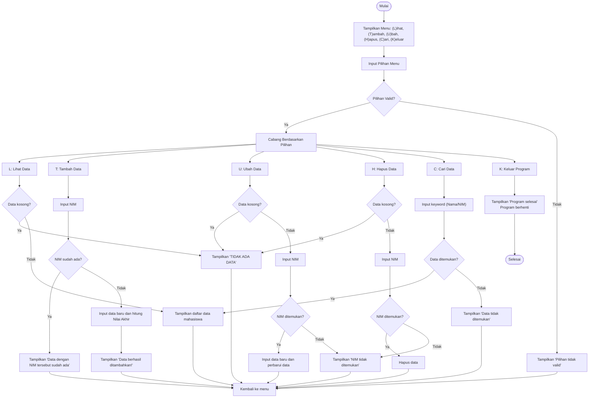

## flowchart

# Pengelolaan Data Mahasiswa
Program berbasis Python yang digunakan untuk mengelola data mahasiswa, seperti menambahkan, melihat, mengubah, menghapus, dan mencari data mahasiswa. Berikut adalah penjelasan fungsi-fungsi utama dalam kode:

## 1. Struktur Data

```python 
data_mahasiswa = {}
```
- ```data_mahasiswa```: Dictionary untuk menyimpan data mahasiswa.
- Key: NIM (Nomor Induk Mahasiswa)
- Value: Dictionary yang berisi detail mahasiswa seperti nama, nilai tugas, UTS, UAS, dan nilai akhir.

## 2. Fungsi Utama
### a. ```lihat_data()```
- Fungsi ini menampilkan semua data mahasiswa dalam format tabel.
- Jika tidak ada data, tabel kosong akan ditampilkan dengan pesan "TIDAK ADA DATA".
- Jika ada data, setiap mahasiswa ditampilkan dengan nomor, nama, NIM, nilai tugas, UTS, UAS, dan nilai akhir (dihitung otomatis).

### b. ```tambah_data()```
- Digunakan untuk menambahkan data mahasiswa baru.
#### 1. Meminta pengguna memasukkan:
- NIM, Nama, Nilai Tugas, Nilai UTS, dan Nilai UAS.
#### 2. Menghitung Nilai Akhir menggunakan rumus:
- Nilai Akhir=(Nilai Tugas×30%)+(Nilai UTS×35%)+(Nilai UAS×35%)
#### 3. Menyimpan data ke dalam dictionary ```data_mahasiswa```.
#### 4. Memeriksa jika NIM sudah ada untuk menghindari duplikasi.

### c. ```ubah_data()```
- Mengubah data mahasiswa berdasarkan NIM.
#### 1. Menampilkan data mahasiswa menggunakan fungsi ```lihat_data()```.
#### 2. Meminta pengguna memasukkan NIM mahasiswa yang akan diubah.
#### 3. Jika NIM ditemukan, pengguna dapat memasukkan data baru (Nama, Nilai Tugas, UTS, UAS).
#### 4. Nilai Akhir dihitung ulang, dan data diperbarui.

### d. ```hapus_data()```
- Menghapus data mahasiswa berdasarkan NIM.
#### 1. Menampilkan data mahasiswa menggunakan fungsi ```lihat_data()```.
#### 2. Meminta pengguna memasukkan NIM yang ingin dihapus.
#### 3. Jika NIM ditemukan, data dihapus dari dictionary ```data_mahasiswa```.


### e. ```cari_data()```
- Mencari data mahasiswa berdasarkan Nama atau NIM.
#### 1. Meminta pengguna memasukkan keyword pencarian.
#### 2. Mencari data yang sesuai (Nama atau NIM) dengan metode filter.
#### 3. Menampilkan hasil pencarian dalam format tabel.
#### 4. Jika tidak ditemukan, menampilkan pesan "Data tidak ditemukan".

## 3. Perulangan Utama
```python
while True:
    pilihan = input("[(L)ihat (T)ambah (U)bah (H)apus (C)ari (K)eluar] : ").lower()
    ...
```
- Program berjalan dalam perulangan while hingga pengguna memilih untuk keluar (```K```).
- Berdasarkan input pengguna, fungsi yang sesuai akan dipanggil:
  - ```L```: Memanggil ```lihat_data()```
  - ```T```: Memanggil ```tambah_data()```
  - ```U```: Memanggil ```ubah_data()```
  - ```H```: Memanggil ```hapus_data()```
  - ```C```: Memanggil ```cari_data()```
  - ```K```: Mengakhiri program

## 4. Alur Eksekusi
#### 1. Program menunggu input pengguna untuk memilih aksi.
#### 2. Berdasarkan pilihan:
- Menambahkan, mengubah, menghapus, mencari, atau melihat data mahasiswa.
#### 3. Program terus berjalan hingga pengguna memilih opsi keluar.

## Keunggulan
- Dinamis: Data dapat ditambah, diubah, dan dihapus secara langsung.
- Interaktif: Menu berbasis teks mudah diikuti.
- Struktur Data Sederhana: Memanfaatkan dictionary Python untuk menyimpan data.

## Kekurangan
- Tidak ada validasi input untuk nilai numerik (contoh: nilai tugas, UTS, UAS bisa tidak valid jika pengguna memasukkan string).
- Tidak ada penyimpanan permanen (data akan hilang setelah program dihentikan).

## Kode 
```python
data_mahasiswa = {}

def lihat_data():
    if not data_mahasiswa:
        print("Daftar Nilai")
        print("=" * 81)
        print(f"{'No'.center(5)}|{'Nama'.center(15)}|{'NIM'.center(10)}|{'Nilai Tugas'.center(13)}|{'Nilai UTS'.center(10)}|{'Nilai UAS'.center(10)}|{'Nilai Akhir'.center(10)}|")
        print("=" * 81)
        print(f"{'TIDAK ADA DATA'.center(75)}")
        print("=" * 81)
        return
    print("Daftar Nilai")
    print("=" * 81)
    print(f"{'No'.center(5)}|{'Nama'.center(15)}|{'NIM'.center(10)}|{'Nilai Tugas'.center(13)}|{'Nilai UTS'.center(10)}|{'Nilai UAS'.center(10)}|{'Nilai Akhir'.center(10)}|")
    print("=" * 81)
    for i, (nim, mhs) in enumerate(data_mahasiswa.items(), start=1):
        print(f"{str(i).center(5)}|{mhs['nama'].ljust(15)}|{nim.center(10)}|{str(mhs['tugas']).center(13)}|{str(mhs['uts']).center(10)}|{str(mhs['uas']).center(10)}|{format(mhs['nilai_akhir'], '.2f').center(10)} |")
    print("=" * 81)

def tambah_data():
    print("Tambah Data")
    nim = input("NIM: ")
    if nim in data_mahasiswa:
        print("Data dengan NIM tersebut sudah ada!")
        return
    nama = input("Nama: ")
    tugas = float(input("Nilai Tugas: "))
    uts = float(input("Nilai UTS: "))
    uas = float(input("Nilai UAS: "))
    nilai_akhir = (tugas * 0.3) + (uts * 0.35) + (uas * 0.35)

    data_mahasiswa[nim] = {
        "nama": nama,
        "tugas": tugas,
        "uts": uts,
        "uas": uas,
        "nilai_akhir": nilai_akhir
    }
    print("Data berhasil ditambahkan!")

def ubah_data():
    lihat_data()
    if not data_mahasiswa:
        return
    
    nim = input("Masukkan NIM data yang akan diubah: ")
    if nim in data_mahasiswa:
        print("Masukkan Data Baru")
        nama = input("Nama: ")
        tugas = float(input("Nilai Tugas: "))
        uts = float(input("Nilai UTS: "))
        uas = float(input("Nilai UAS: "))
        nilai_akhir = (tugas * 0.3) + (uts * 0.35) + (uas * 0.35)

        data_mahasiswa[nim] = {
            "nama": nama,
            "tugas": tugas,
            "uts": uts,
            "uas": uas,
            "nilai_akhir": nilai_akhir
        }
        print("Data berhasil diubah!")
    else:
        print("NIM tidak ditemukan!")

def hapus_data():
    lihat_data()
    if not data_mahasiswa:
        return

    nim = input("Masukkan NIM data yang akan dihapus: ")
    if nim in data_mahasiswa:
        del data_mahasiswa[nim]
        print("Data berhasil dihapus!")
    else:
        print("NIM tidak ditemukan!")

def cari_data():
    keyword = input("Masukkan nama atau NIM yang ingin dicari: ")
    hasil_cari = {nim: mhs for nim, mhs in data_mahasiswa.items() if keyword.lower() in mhs['nama'].lower() or keyword in nim}
    
    if hasil_cari:
        print("Hasil Pencarian:")
        print("=" * 81)
        print(f"{'No'.center(5)}|{'Nama'.center(15)}|{'NIM'.center(10)}|{'Nilai Tugas'.center(13)}|{'Nilai UTS'.center(10)}|{'Nilai UAS'.center(10)}|{'Nilai Akhir'.center(10)}|")
        print("=" * 81)
        for i, (nim, mhs) in enumerate(hasil_cari.items(), start=1):
            print(f"{str(i).center(5)}|{mhs['nama'].ljust(15)}|{nim.center(10)}|{str(mhs['tugas']).center(13)}|{str(mhs['uts']).center(10)}|{str(mhs['uas']).center(10)}|{format(mhs['nilai_akhir'], '.2f').center(10)}|")
        print("=" * 81)
    else:
        print("Data tidak ditemukan.")

while True:
    pilihan = input("[(L)ihat (T)ambah (U)bah (H)apus (C)ari (K)eluar] : ").lower()
    if pilihan == 't':
        tambah_data()
    elif pilihan == 'u':
        ubah_data()
    elif pilihan == 'h':
        hapus_data()
    elif pilihan == 'l':
        lihat_data()
    elif pilihan == 'c':
        cari_data()
    elif pilihan == 'k':
        print("Program selesai.")
        break
    else:
        print("Pilihan tidak valid!")
```

## Output


